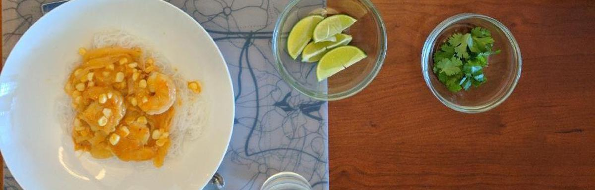

# Coconut and Shrimp Curry over Glass Noodles

An incredibly simple dish, with ingredients you can find almost entirely at your local Safeway. It's cheap and pretty classy, and really satisfying. Great for a summer evening or a mild fall lunch.  

## The Meal

### Context 

Cold-noodle dishes are some of my favorite. While in China, Szechuan Liangmian changed my view on Chinese noodle dishes, and I fell in love with the colder style. During the summer, I was trying to figure out what I wanted to make with my Godfather who is a chef. I found a recipe for a cold noodle curry dish, which was different from Liangmian but sounded interesting. With some modifications and deviations from that recipe (I can't find it for the life of me. If you know the original, please submit an issue and I'll include it with heaps of praise for the original creator), I think this dish is perfect for a classy evening meal in the summer.

### Ingredients

Main dish: 

| Ingredient | Note | Total |
| ---------- | ---- | -----:|
| Glass Noodles | Vermicelli is the next best thing | 12 oz |
| Shrimp | Peeled, deveined | 1 lb |
| Ears of Corn | Kernels removed from cob | 2x |
| Curry Powder | | 1 tbsp |
| Garlic | Grated | 3 tsp |
| Ginger | Grated | 1 tbsp |
| Lime | Zested, juiced | 1x |
| Fish Sauce | | 1 tbsp |
| Unsweetened Coconut Milk | | 14 oz |
| Honey | Change for different levels of sweetness | 1 tbsp |

The garnish:

| Ingredient | Note | Total |
| ---------- | ---- | -----:|
| Cilantro | | 2 stems |
| Mint | | 2 stems |
| Basil | | 2 stems |
| Lime | Quartered | 1x |
